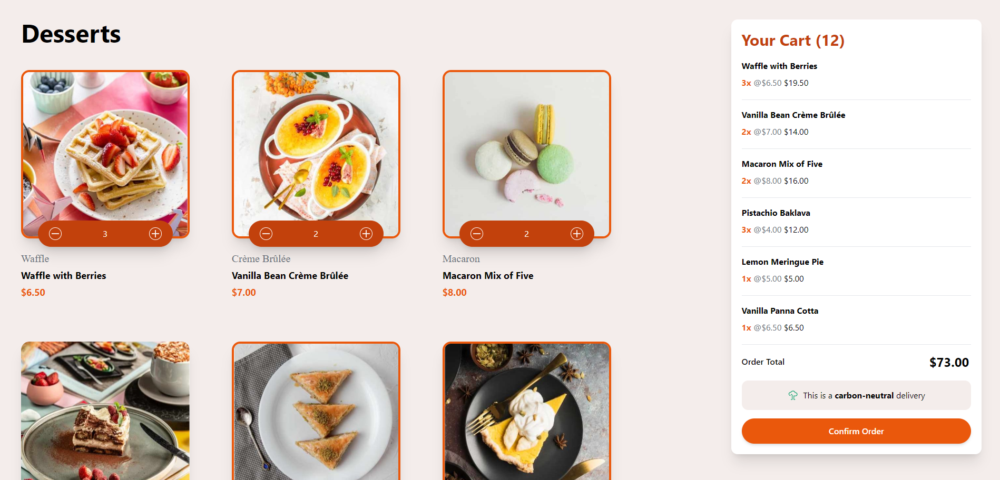

# Dessert Shop - Product List with Cart

Welcome to the **Dessert Shop** web application! This project showcases a list of delectable desserts where users can add items to their cart and confirm orders. It's built using React, Tailwind CSS, and utilizes React Context API for state management.

## Demo



_Note: Include a screenshot of your app in the `screenshots` folder for the above image to display._

## Live Demo

Check out the live demo of the application [here](https://dessert-shop-five.vercel.app/).

## Table of Contents

- [Dessert Shop - Product List with Cart](#dessert-shop---product-list-with-cart)
  - [Demo](#demo)
  - [Live Demo](#live-demo)
  - [Table of Contents](#table-of-contents)
  - [Features](#features)
  - [Installation](#installation)

## Features

- Display a list of dessert products with images, names, categories, and prices.
- Responsive design that adapts to mobile, tablet, and desktop screens.
- Users can add items to the cart and adjust quantities.
- Cart updates in real-time with total items and order total.
- Order confirmation modal with a summary of items and total price.
- Dynamic image loading based on screen size (mobile, tablet, desktop).

## Installation

1. **Clone the repository:**

   ```bash
   git clone https://github.com/yourusername/dessert-shop.git
   cd dessert-shop
   npm install
   npm run dev
   ```
